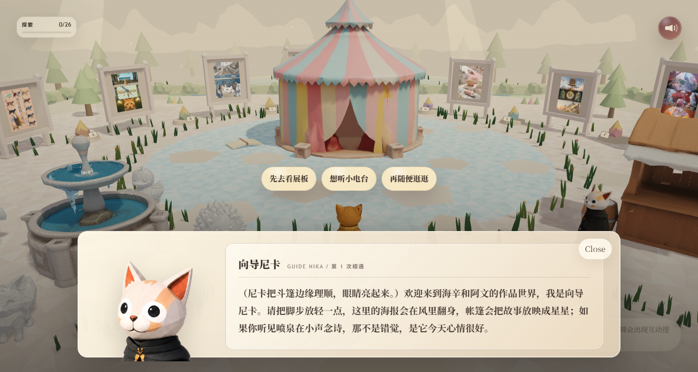
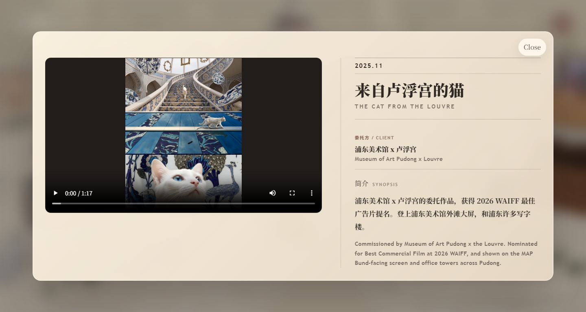
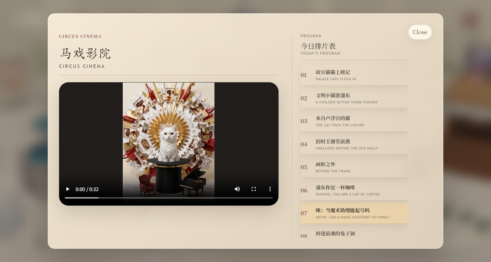
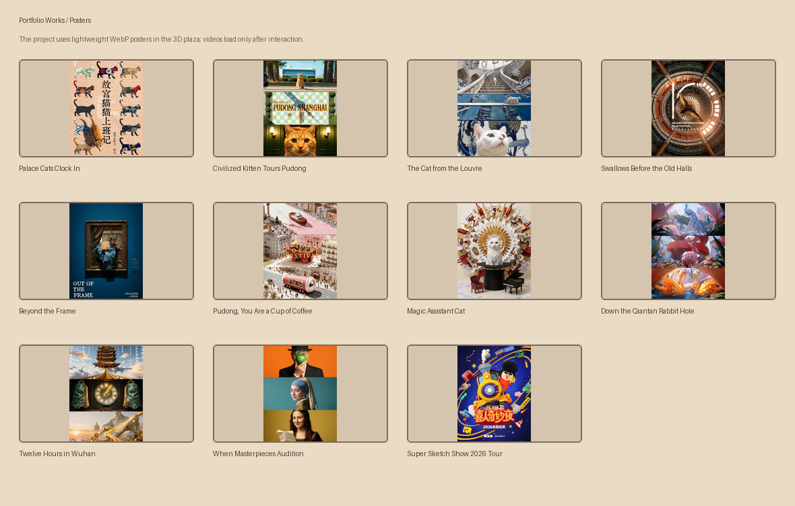

# Ring Hyacinth 3D Portfolio Plaza

一个可探索的 3D 个人主页。访客会进入一座低多边形、绘本质感的作品广场，操纵一只披风小猫，在展板、马戏影院、合作小铺、小电台、制作手册、社交雕塑和关于我的碎片之间慢慢逛。


## What This Is

This repository now contains a reconstructed source version of Ring Hyacinth's interactive 3D portfolio site, plus the optimized public media files used by the static deployment.

The source project is a React + Vite + TypeScript + Three.js application. The original private production workspace is not included, but this repo has a maintainable public implementation that rebuilds the explorable plaza, work modals, cinema, radio links, making notes, contact booth, social sculptures, guide dialog, mobile controls, and deployment media pipeline.

## How To Visit

Open the live site:

Recommended:

- Desktop Chrome / Edge / Safari
- A reasonably recent laptop or desktop GPU
- Recent mobile browsers with touch controls; landscape orientation is more comfortable
- Sound on if you want the background music and video audio

Mobile is supported with a virtual joystick, short on-screen hints, and compact modal layouts for work pages, the cinema, radio links, and making notes.

## Local Development

Install dependencies:

```bash
npm install
```

Run the source app locally:

```bash
npm run dev
```

Build the static deployment:

```bash
npm run build
```

The Vite build writes to `dist/` and copies the public media folders needed by GitHub Pages:

- `assets/audio/`
- `assets/models/`
- `assets/podcasts/`
- `assets/posters/`
- `assets/textures/`
- `assets/videos-web/`
- `docs/`

## How To Play

- `W` / `S`: move forward and backward
- `A` / `D`: turn the cat
- Mouse drag: adjust view direction
- `E`: interact with the nearest highlighted object
- `1`: talk to Guide Nika when nearby
- Click nearby objects: open the same interactions directly
- Mobile: use the left joystick to move, drag the scene to adjust view direction, and tap the interaction button when it appears

The site only loads video when a visitor opens a work detail or the circus cinema. The plaza itself uses lightweight posters and 3D models first, and the large physics runtime is not preloaded from the initial HTML.

## Interaction Moments

A few moments from the explorable plaza: Guide Nika's first greeting, a playable work detail page, and the circus cinema program.



Guide Nika introduces the world when the visitor walks near the shop.



Poster boards open bilingual project pages with compressed web MP4 playback.



The circus tent works like a small screening room with a randomized program list.

## Things To Find

- Work boards: click a poster board to open a bilingual work page with video and project notes.
- Circus Cinema: open the tent to play a random available work from the program list; on mobile, the program becomes a horizontal card rail.
- Collab Shop: leave a project note through a mailto flow.
- Tiny Radio: browse podcast appearances with compact mobile link cards.
- Making Notes: open tutorial / behind-the-scenes links with compact mobile link cards.
- Guide Nika: talk to the little guide cat near the shop and choose a short reply inside the dialog.
- Social sculpture: open the GitHub repositories page.
- A-F memo sculptures: read small biographical fragments scattered around the plaza.

## Works In The Plaza

The 3D boards use lightweight WebP posters. Available works use compressed web MP4 videos; one touring work remains poster-only.



Included works:

- Palace Cats Clock In
- A Civilized Kitten Tours Pudong
- The Cat from the Louvre
- Swallows Before the Old Halls
- Beyond the Frame
- Pudong, You Are a Cup of Coffee
- Meow: Can a Magic Assistant Go Viral?
- Down the Qiantan Rabbit Hole
- Twelve Hours in Wuhan
- When Masterpieces Audition
- Super Sketch Show 2026 National Tour

## Video Strategy

The original local videos are much larger than a static site should ship directly. For the public demo, the videos were transcoded into web playback copies:

- 720p
- H.264 video
- AAC audio
- MP4 `faststart`
- Around 121 MB total for 10 playable videos

This repository includes only the web playback versions under:

```text
assets/videos-web/
```

For a longer-term production setup, the same site can point to Cloudflare Stream, Mux, or an object-storage CDN by setting a video base URL during the source build.

## Loading Strategy

The built site keeps large libraries in separate vendor chunks so small UI updates do not invalidate every runtime file. The largest physics chunk remains available for the 3D scene, but it is not listed as an initial HTML `modulepreload`; this keeps mobile entry from competing with a 1 MB+ gzip physics download before the app starts.

## Repository Layout

```text
.
├─ index.html
├─ assets/
│  ├─ audio/          # Background music
│  ├─ models/         # GLB characters, landmarks, environment sprites
│  ├─ posters/        # Lightweight WebP board posters
│  ├─ textures/       # WebP ground / carpet textures
│  └─ videos-web/     # Public web playback MP4 files
└─ docs/
   └─ media/          # README screenshots and GIF
```

## Tech Stack

Built from a private source project using:

- React
- Vite
- TypeScript
- Three.js
- `@react-three/fiber`
- `@react-three/drei`
- `@react-three/rapier`
- Framer Motion
- Tailwind CSS

## Credits

Created by Kenshin as a 3D portfolio plaza for AI film, creative technology, and visual storytelling work.

Background music: 时空储蓄罐《Deposit》.

The public deploy repository is maintained as a readable showcase and stable static hosting target.
