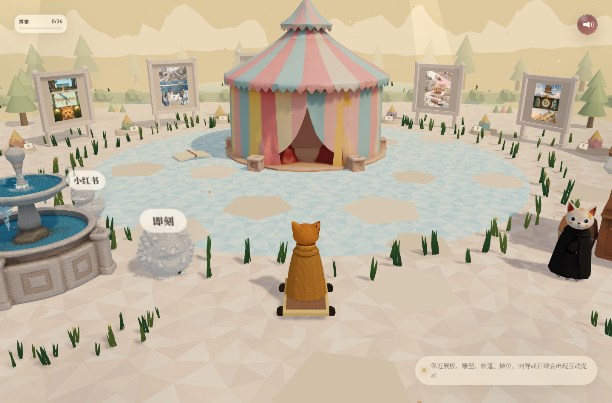
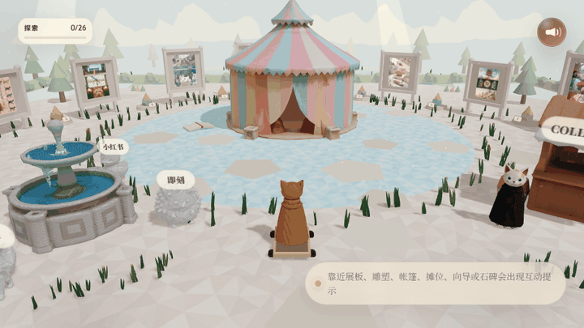

# Kenshin Site

一个可探索的 3D 个人主页。访客会进入一座低多边形、绘本质感的作品广场，操纵一只披风小猫，在展板、马戏影院、合作小铺、小电台、制作手册、社交雕塑和关于我的碎片之间慢慢逛。





## What This Is

Kenshin 的交互式 3D 作品展示空间，基于 React + Vite + TypeScript + Three.js 构建。

访客以第一人称视角探索这座广场，与作品展板、马戏影院、合作摊位等元素互动。广场中散布着五块记录个人碎片的雕塑：身份卡、职业经历、通行证、荣誉证书和全息成就面板。

## How To Visit

- Desktop Chrome / Edge / Safari
- A reasonably recent laptop or desktop GPU
- Recent mobile browsers with touch controls; landscape orientation is more comfortable
- Sound on if you want the background music and video audio

Mobile is supported with a virtual joystick, short on-screen hints, and compact modal layouts.

## Local Development

```bash
npm install
npm run dev
```

Build the static deployment:

```bash
npm run build
```

## How To Play

- `W` / `S`: move forward and backward
- `A` / `D`: turn the cat
- Mouse drag: adjust view direction
- `E`: interact with the nearest highlighted object
- Mobile: use the left joystick to move, drag the scene to adjust view direction, and tap the interaction button when it appears

## Works In The Plaza

- **Codepilot** (2026.4) — AI Agent 桌面客户端，支持 Assistant Workspace、生成式 UI、远程 Bridge、MCP+Skills、Media Studio
- **剧本生成 Agent** (2026.5) — 影视幕后工作流 SaaS，实时协作剧本编辑器配全剧本 AI 上下文
- **剑心的军火库** (2026.5) — 收录高审美网站的导航站

其余展板陆续添加中。

## Things To Find

- **Work boards**: click a poster board to open a bilingual work page with video and project notes
- **Circus Cinema**: open the tent to play a randomized program list; on mobile, the program becomes a horizontal card rail
- **Collab Shop**: leave a project note through a mailto flow
- **Tiny Radio**: browse podcast appearances with compact mobile link cards
- **Making Notes**: open tutorial / behind-the-scenes links — currently featuring "Thinking in Claude Code" PDF
- **Social sculptures**: open the GitHub repositories page and other social links
- **A-E memo sculptures**: read biographical fragments scattered around the plaza

## Repository Layout

```text
.
├─ index.html
├─ assets/
│  ├─ audio/          # Background music
│  ├─ books/         # PDF tutorials
│  ├─ certs/          # Certificates
│  ├─ models/         # GLB characters, landmarks, environment sprites
│  ├─ posters/        # Lightweight WebP board posters
│  ├─ textures/       # WebP ground / carpet textures
│  └─ videos-web/     # Public web playback MP4 files
├─ src/               # React + Three.js source
└─ docs/
   └─ media/          # README screenshots and GIF
```

## Tech Stack

- React
- Vite
- TypeScript
- Three.js
- `@react-three/fiber`
- `@react-three/drei`
- `@react-three/rapier`
- Framer Motion

## Credits

Created by Kenshin as a 3D portfolio plaza for AI tools, creative technology, and visual storytelling work.

Background music: 时空储蓄罐《Deposit》.